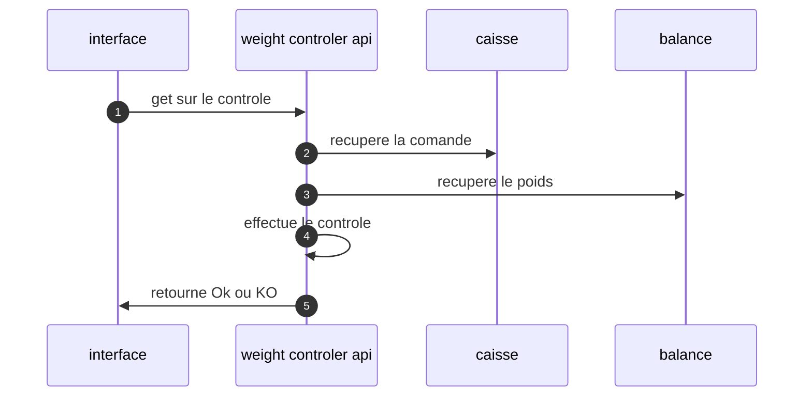
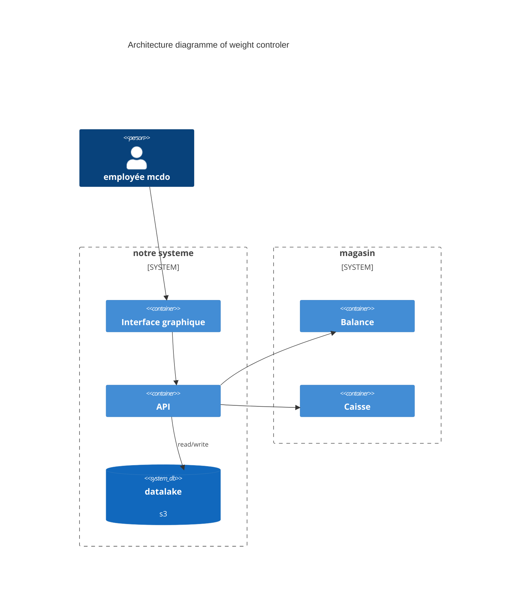

# Architecture 

```mermaid
sequenceDiagram
    autonumber
    interface ->> weight controler api: get sur le controle
    weight controler api ->> caisse : recupere la comande 
    weight controler api->> balance : recupere le poids
    weight controler api ->> weight controler api : effectue le controle
    weight controler api ->> interface: retourne Ok ou KO
```

```mermaid
C4Context
    title Architecture diagramme of weight controler
    Person(person1,"employée mcdo",)
    System_Boundary(systeme1,"notre systeme"){
        Container(streamlit,"Interface graphique")
        Container(api,"API")
        SystemDb(datalake,"datalake","s3")
    }
    System_Boundary(systeme2,"magasin"){
        Container(balance,"Balance ")
        Container(caisse,"Caisse")
    }
    Rel(person1,streamlit,"")
    Rel(streamlit,api,"")
    Rel(api,balance,"")
    Rel(api,caisse,"")
    Rel(api,datalake,"read/write")
    
```